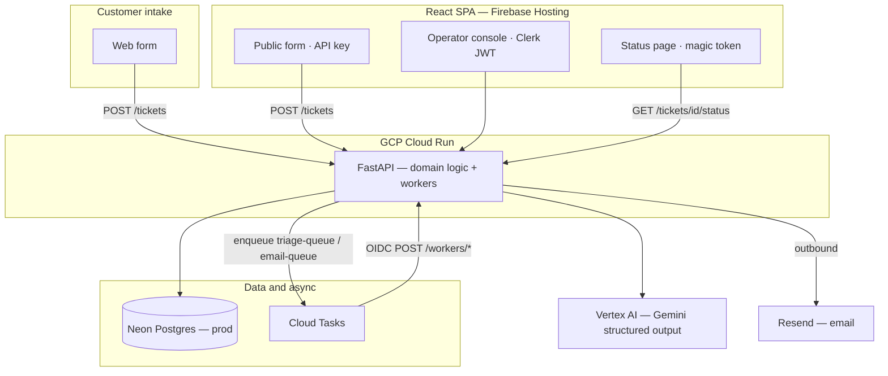

# Triage

AI-assisted support ticketing for small teams — one queue, automatic classification, and email-backed customer updates without a heavy helpdesk.

**Primary purpose:** [Portfolio showcase](docs/scoping-handoff.md) — live demo on kofeejan subdomains, not a micro-SaaS or internal tool.

**Status:** Backend done (57 pytest tests). Frontend Phase 3 largely done — all four routes (`/`, `/submit`, `/operator`, `/ticket/{id}`), Clerk wired, ~46 Vitest tests. **Phase 3 gap:** inline magic link on submit success (PRD §10.4). Prod deploy (Phase 4) pending: Neon, Cloud Run, Firebase, budget kill-switch.

---

## What it does

Triage gives a small support team a single place to handle customer requests:

| Who          | What they get                                                                                                                             |
| ------------ | ----------------------------------------------------------------------------------------------------------------------------------------- |
| **Customer** | Submit via web form; track status with a magic link (no account required).                                                       |
| **System**   | Classifies each ticket with Gemini (category, priority, escalation, draft reply) and sends confirmation and resolution emails via Resend. |
| **Agent**    | Sign in with Clerk; work the queue, edit the AI draft, reply, and resolve.                                                                |

**Flow:** intake → async AI triage → confirmation email → operator console → reply and resolve → reply email → customer status page.

**Not in scope** (permanent): inbound email intake, multi-tenant orgs, billing, SLO dashboards, real dogfooding. Also out: threading, attachments, role hierarchies beyond agent vs customer. See [scoping-handoff.md](docs/scoping-handoff.md).

---

## Why teams use it

- **Fast intake** — Web form lands in one queue.
- **Less triage busywork** — Gemini suggests category, priority, escalation, and a first-draft reply before an agent opens the ticket.
- **Customers stay informed** — Magic-link status pages and transactional email; no portal login.
- **Small-team fit** — One backend, one database, serverless async — designed for GCP free tiers and Neon Postgres.

Under the hood: FastAPI on Cloud Run, React on Firebase Hosting, Neon Postgres (prod), Cloud Tasks workers, **`google-genai`** with **`gemini-3.1-flash-lite-preview`** (structured JSON triage), Clerk for agents, and Resend for outbound email.

---

## Architecture



- **One public Cloud Run backend** — app-layer auth for agents, customers, and workers (OIDC).
- **Custom domains:** `api.triage.kofeejan.com` → Cloud Run; `triage.kofeejan.com` → Firebase Hosting.
- **Deploy identity:** manual `gcloud run deploy`; `triage-runtime@` runs the service with Secret Manager and Vertex access.

---

## Tech stack

| Layer | Choices                                                                 |
| ----- | ----------------------------------------------------------------------- |
| API   | Python 3.13, FastAPI, uv                                                |
| Data  | Docker Postgres (local); Neon Postgres (prod, future)                 |
| AI    | `google-genai` SDK — `gemini-3.1-flash-lite-preview`; Vertex + ADC (prod), `GEMINI_API_KEY` (local AI Studio) |
| Queue | GCP Cloud Tasks (OIDC HTTP targets)                                     |
| Email | Resend (outbound only in v1)                                    |
| Auth  | Clerk (operators), magic tokens (customers), API key (public form)      |
| UI    | React, Vite, TanStack Router, Clerk, shadcn/ui                          |
| Infra | GCP Cloud Run, Cloud Tasks, Firebase Hosting, Secret Manager, Cloud Monitoring |

---

## Repository layout

```text
backend/          FastAPI app, Alembic, tests
frontend/         React/Vite SPA (all four v1 routes)
scripts/
  deploy-backend.sh   Cloud Run deploy wrapper (rightsizing + labels)
docs/
  README.md                 Documentation index (start here)
  scoping-handoff.md        Portfolio direction (canonical)
  triage-prd.md             Product spec (v3.0)
  guides/
    gcp-production-setup.md Manual prod deploy checklist
    gcp-firebase-hosting.md Firebase Hosting setup
  adr/                      Architecture decision records
  archive/                  Historical plans + future-work refs
```

---

## Local development

```bash
cp .env.example .env   # fill keys for local services
docker compose up --build
```

- Backend: [http://localhost:8080/health](http://localhost:8080/health)  
- Frontend: [http://localhost:3000](http://localhost:3000)
- Database: Docker Postgres — not Neon

Local triage runs **synchronously** with `CLOUD_TASKS_ENABLED=false` (no GCP queue required). Creating a ticket calls Gemini inline and returns classification fields on the `201` response.

### Gemini (local)

Set in `.env` (see [`.env.example`](.env.example)):

| Mode | Required env |
| ---- | ------------ |
| **AI Studio (default)** | `GEMINI_API_KEY`, `GOOGLE_GENAI_USE_VERTEXAI=false` |
| **Vertex + ADC** | `GOOGLE_GENAI_USE_VERTEXAI=true`, `GCP_PROJECT_ID`, `VERTEX_LOCATION=global`, plus `gcloud auth application-default login` |

Model defaults to `gemini-3.1-flash-lite-preview` (`GEMINI_MODEL`). Production uses Vertex only on `triage-runtime@` — no `GEMINI_API_KEY` in Secret Manager ([ADR-0004](docs/adr/0004-vertex-ai-gemini-on-cloud-run.md)).

### Try the API

```bash
curl -s -X POST http://localhost:8080/tickets \
  -H "Content-Type: application/json" \
  -H "x-api-key: $API_KEY" \
  -d '{
    "subject": "Charged twice for same order",
    "body": "Order #8821 shows two charges on my card. Please refund the duplicate.",
    "customer_email": "customer@example.com",
    "customer_name": "Jane Doe"
  }'
```

Use `API_KEY` from your `.env`. On success, the response includes Gemini-assigned `category`, `priority`, `escalate`, and `ai_draft_reply`. OpenAPI: [`backend/openapi.yaml`](backend/openapi.yaml) · local docs at [http://localhost:8080/docs](http://localhost:8080/docs) when `IS_PRODUCTION=false`.

### Tests

```bash
cd backend && uv sync --dev && uv run pytest tests/ -v
```

---

## Deployment (overview)

**Portfolio minimal path** ([scoping-handoff.md](docs/scoping-handoff.md), [ADR-0019](docs/adr/0019-cloud-run-firebase-hosting-production.md)) — not full Stage 0–5 production checklist:

1. Neon Postgres + manual migrations
2. **Cloud Run** — FastAPI at `api.triage.kofeejan.com` (120s timeout, 512Mi/1 CPU, max 5 instances)
3. **Firebase Hosting** — React SPA at `triage.kofeejan.com`
4. Cloud Tasks queues (`triage-queue`, `email-queue`) with OIDC invoker SA
5. Resend outbound domain
6. **Observability** — structured JSON logs ([ADR-0007](docs/adr/0007-structured-logs-and-one-alert.md)); two alerts only: `email_send_failed` ([ADR-0021](docs/adr/0021-cloud-monitoring-email-alert.md)) + $5/mo budget kill-switch ([ADR-0023](docs/adr/0023-budget-triggered-kill-switch-for-public-demo.md)). Full SLO stack is [archived future work](docs/archive/gcp-monitoring-slo.md) ([ADR-0025](docs/adr/0025-monitoring-slo-scope-cut-for-portfolio.md)).
7. **Cost controls** — $5/mo GCP budget → Pub/Sub → scale Cloud Run to 0; resource labels (`env=prod`, `app=triage`, `team=solo`)
8. **Demo data** — `scripts/seed_agent.py` + `scripts/seed_demo.py` (synthetic tickets for smoke test)

**Deploy backend** (sets `GOOGLE_GENAI_USE_VERTEXAI=true`, `GEMINI_MODEL=gemini-3.1-flash-lite-preview`, Vertex via `triage-runtime@` — no prod `GEMINI_API_KEY`):

```bash
export PROJECT_ID=your-gcp-project-id
export API_DOMAIN=https://api.triage.kofeejan.com
export APP_DOMAIN=https://triage.kofeejan.com
./scripts/deploy-backend.sh
```

Checklist: [docs/guides/gcp-production-setup.md](docs/guides/gcp-production-setup.md). Firebase: [docs/guides/gcp-firebase-hosting.md](docs/guides/gcp-firebase-hosting.md). Doc index: [docs/README.md](docs/README.md).

**Solo dev ladder:** `feature/*` → PR → `main` (CI) → manual promote → prod.

**CI:** `.github/workflows/ci.yml` runs path-filtered backend (pytest + Docker build) and frontend (test + build) on push/PR. Deploys are **manual CLI** — no GHA deploy workflows yet.

See [CONTEXT.md](CONTEXT.md) for domain terms. ADRs 0014, 0015, 0018 describe the superseded Railway/Vercel path.

---

## Roadmap

| Phase | Focus                                                            |
| ----- | ---------------------------------------------------------------- |
| 1     | Models, migrations, ticket CRUD, Clerk + magic token, rate limit |
| 2     | Gemini triage, Cloud Tasks workers, Resend outbound              |
| 3     | Operator console, customer status page, public form (inline magic link gap) |
| 4     | GCP + Firebase production deploy, end-to-end smoke test          |

---

## License

[MIT](LICENSE) — Copyright (c) 2026 ssuish
