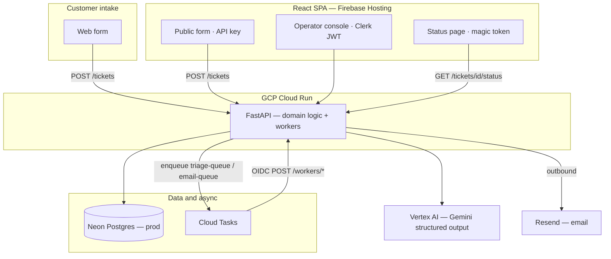

# Triage

AI-assisted support ticketing for small teams — one queue, automatic classification, and email-backed customer updates without a heavy helpdesk.

**Status:** In active development. Backend foundation (ticket CRUD, auth, rate limits) is done; async workers, triage, and operator console are in progress per the week plans.

---

## What it does

Triage gives a small support team a single place to handle customer requests:


| Who          | What they get                                                                                                                             |
| ------------ | ----------------------------------------------------------------------------------------------------------------------------------------- |
| **Customer** | Submit via web form; track status with a magic link (no account required).                                                       |
| **System**   | Classifies each ticket with Gemini (category, priority, escalation, draft reply) and sends confirmation and resolution emails via Resend. |
| **Agent**    | Sign in with Clerk; work the queue, edit the AI draft, reply, and resolve.                                                                |


**Flow:** intake → async AI triage → confirmation email → operator console → reply and resolve → reply email → customer status page.

**Not in v1:** inbound email intake, threading, SLA dashboards, attachments, role hierarchies beyond agent vs customer, multi-tenant orgs.

---

## Why teams use it

- **Fast intake** — Web form lands in one queue.
- **Less triage busywork** — Gemini suggests category, priority, escalation, and a first-draft reply before an agent opens the ticket.
- **Customers stay informed** — Magic-link status pages and transactional email; no portal login.
- **Small-team fit** — One backend, one database, serverless async — designed for GCP free tiers and Neon Postgres.

Under the hood: FastAPI on Cloud Run, React on Firebase Hosting, Neon Postgres (prod), Cloud Tasks workers, Vertex Gemini (structured JSON triage), Clerk for agents, and Resend for outbound email.

---

## Architecture




- **One public Cloud Run backend** — app-layer auth for agents, customers, and workers (OIDC).
- **Custom domains:** `api.yourdomain.com` → Cloud Run; `app.yourdomain.com` → Firebase Hosting.
- **Deploy identity:** manual `gcloud run deploy`; `triage-runtime@` runs the service with Secret Manager and Vertex access.

---

## Tech stack


| Layer | Choices                                                                 |
| ----- | ----------------------------------------------------------------------- |
| API   | Python 3.13, FastAPI, uv                                                |
| Data  | Docker Postgres (local); Neon Postgres (prod, future)                 |
| AI    | `google-genai`, Vertex AI (prod), optional API key (local)              |
| Queue | GCP Cloud Tasks (OIDC HTTP targets)                                     |
| Email | Resend (outbound only in v1)                                    |
| Auth  | Clerk (operators), magic tokens (customers), API key (public form)      |
| UI    | React, Vite, TanStack Router (deferred)                                 |
| Infra | GCP Cloud Run, Cloud Tasks, Firebase Hosting, Secret Manager            |


---

## Repository layout

```text
backend/          FastAPI app, Alembic, tests
frontend/         React/Vite SPA (placeholder)
docs/
  triage-prd.md   Product spec
  gcp-production-setup.md   Manual prod deploy checklist
  gcp-firebase-hosting.md   Firebase Hosting setup
```

---

## Local development

```bash
cp .env.example .env   # fill keys for local services
docker compose up --build
```

- Backend: [http://localhost:8080/health](http://localhost:8080/health)  
- Frontend: [http://localhost:3000](http://localhost:3000) (health-check placeholder)
- Database: Docker Postgres — not Neon

Local triage runs **synchronously** with `CLOUD_TASKS_ENABLED=false` (no GCP queue required).

### Tests

```bash
cd backend && uv sync --dev && uv run pytest tests/ -v
```

---

## Deployment (overview)

Production path ([ADR-0019](docs/adr/0019-cloud-run-firebase-hosting-production.md)):

1. Neon database (future) + manual migrations when prod DB exists
2. **Cloud Run** — FastAPI backend at `api.yourdomain.com` (~120s timeout for workers)
3. **Firebase Hosting** — React SPA at `app.yourdomain.com`
4. Cloud Tasks queues (`triage-queue`, `email-queue`) with OIDC invoker SA
5. Resend outbound domain; Cloud Monitoring alert on `email_send_failed` ([ADR-0021](docs/adr/0021-cloud-monitoring-email-alert.md))

**Solo dev ladder:** `feature/*` → PR → `main` (CI) → manual promote → prod. See [docs/gcp-production-setup.md](docs/gcp-production-setup.md).

**CI:** `backend-ci.yml` and `frontend-ci.yml` run tests on push/PR. Deploys are **manual CLI** — no GHA deploy workflows yet.

See [CONTEXT.md](CONTEXT.md) for domain terms. ADRs 0014, 0015, 0018 describe the superseded Railway/Vercel path.

---

## Roadmap


| Phase | Focus                                                            |
| ----- | ---------------------------------------------------------------- |
| 1     | Models, migrations, ticket CRUD, Clerk + magic token, rate limit |
| 2     | Gemini triage, Cloud Tasks workers, Resend outbound              |
| 3     | Operator console, customer status page, public form              |
| 4     | GCP + Firebase production deploy, end-to-end smoke test          |


---

## License

[MIT](LICENSE) — Copyright (c) 2026 ssuish
