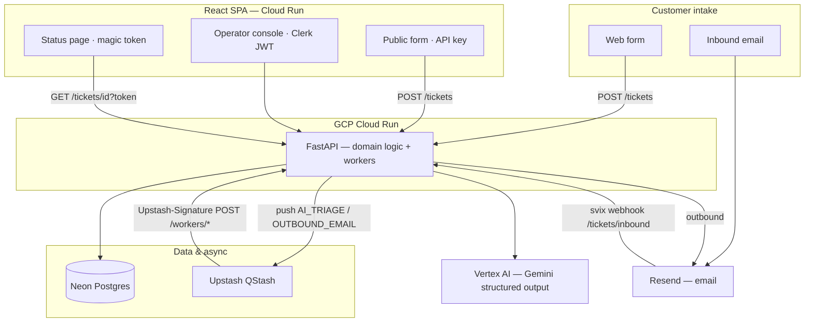

# Triage

AI-assisted support ticketing — portfolio project demonstrating async job pipelines, production-style GCP patterns, and full-stack integration on serverless infrastructure.

**Status:** In active development. Monorepo scaffold, CI/deploy workflows, and detailed spec/ADRs are in place; domain features (tickets, triage, operator UI) are being implemented per the week plans.

---

## What it does (complete product)

Triage is a single-queue support system for a small team:

| Actor | Experience |
|-------|------------|
| **Customer** | Submits a ticket via web form or inbound email; receives a magic-link email to track status (no account). |
| **System** | Classifies the ticket with Gemini (category, priority, escalation, draft reply) via QStash workers; sends confirmation and resolution emails through Resend. |
| **Agent** | Signs in with Clerk; views the queue, edits the AI draft, sends a reply, and resolves the ticket. |

**End-to-end flow:** intake → async AI triage → confirmation email → operator console → reply + resolve → reply email → customer status page.

Deliberately **out of scope:** threading, SLA/analytics, attachments, RBAC beyond agent vs customer, multi-tenant orgs. See [docs/triage-prd.md](docs/triage-prd.md) §1.2.

---

## Why it’s useful on a CV / portfolio

Solo-built system showing:

- **Backend:** FastAPI, SQLAlchemy, Alembic, Pydantic, webhook verification (Resend/svix, QStash Receiver)
- **Async jobs:** Upstash QStash HTTP-push workers on the same Cloud Run service (serverless-appropriate)
- **AI:** Gemini via `google-genai` — structured JSON output in prod through **Vertex AI** and runtime service account (no long-lived API key in prod secrets)
- **Reliability:** Timestamp-based worker idempotency for QStash retries; rate-limited public intake; HTML-escaped outbound email
- **Frontend:** React + Vite SPA — public form, Clerk-gated operator console, magic-token status page
- **Ops:** Cloud Run, Neon Postgres, GCP Secret Manager, dedicated `triage-runtime@` SA, manual prod migrations via GitHub Actions

Architecture decisions are documented in [CONTEXT.md](CONTEXT.md) and [docs/adr/](docs/adr/) (13 ADRs from a WAF-style design review).

**Demo readiness:** A recruiter-friendly live demo targets the full flow above on HTTPS (Cloud Run URLs or custom domains). See [docs/learning-and-delivery-guide.md](docs/learning-and-delivery-guide.md) §7 for portfolio tiers.

---

## Architecture



- **One public Cloud Run backend** — app-layer auth on agents, customers, workers, and webhooks ([ADR-0001](docs/adr/0001-single-public-cloud-run-service.md)).
- **Custom domains** map directly to Cloud Run services (`api.*`, `app.*`). A VM/Caddy reverse proxy is **optional**, not required.
- **Deploy identity:** `github-deploy` pushes images; **`triage-runtime@`** runs the service and holds secret + Vertex access ([ADR-0006](docs/adr/0006-dedicated-cloud-run-runtime-sa.md)).

Full diagram and service notes: [docs/triage-prd.md](docs/triage-prd.md) §3.

---

## Tech stack

| Layer | Choices |
|-------|---------|
| API | Python 3.13, FastAPI, uv |
| Data | Neon (Postgres), SQLAlchemy, Alembic |
| AI | `google-genai`, Vertex AI (prod), optional API key (local) |
| Queue | Upstash QStash (`Receiver` + signing keys) |
| Email | Resend (+ svix inbound verification) |
| Auth | Clerk (operators), magic tokens (customers), API key (public form) |
| UI | React, Vite, TanStack Router |
| Infra | GCP Cloud Run, Artifact Registry, Secret Manager; GitHub Actions deploy |

Target running cost: **$0/month** on free tiers ([PRD §14](docs/triage-prd.md)).

---

## Repository layout

```text
backend/          FastAPI app, Alembic, tests
frontend/         React/Vite SPA
docs/
  triage-prd.md   Product spec
  adr/            Architecture decision records
  learning-and-delivery-guide.md
  superpowers/plans/   Week 1–4 implementation plans
CONTEXT.md        Domain glossary + ADR index
```

---

## Documentation

| Doc | Audience |
|-----|----------|
| [docs/triage-prd.md](docs/triage-prd.md) | What we’re building |
| [CONTEXT.md](CONTEXT.md) | Terms and decision index |
| [docs/adr/](docs/adr/) | Why (security, deploy, AI, idempotency) |
| [docs/superpowers/plans/](docs/superpowers/plans/) | How (TDD-style week plans) |
| [docs/learning-and-delivery-guide.md](docs/learning-and-delivery-guide.md) | Solo dev: build order, deploy, portfolio |

---

## Local development

```bash
cp .env.example .env   # fill keys for local services
docker compose up --build
```

- Backend: http://localhost:8080/health  
- Frontend: http://localhost:3000  

Local triage can run **synchronously** with `QSTASH_ENABLED=false` while workers are still in progress.

### Tests

```bash
cd backend && uv sync --dev && uv run pytest tests/ -v
cd frontend && pnpm install && pnpm test
```

---

## Deployment (overview)

Production path (detail in [week 4 plan](docs/superpowers/plans/2026-05-22-week4-deployment.md)):

1. Neon database + manual `workflow_dispatch` migrations  
2. GCP Secret Manager (**14** app secrets; no prod `GEMINI_API_KEY` / `QSTASH_SECRET`)  
3. Cloud Run service **`backend`**: `triage-runtime@`, `--timeout=120`, Vertex + `RATE_LIMIT_TICKETS`  
4. Cloud Run frontend with build-time `VITE_*` vars  
5. Resend domain + QStash signing keys; optional custom domains on Run  

CI: `.github/workflows/` run tests and deploy on push to `main` (Workload Identity Federation). Extend the deploy step with Secret Manager and runtime SA per the week 4 plan when going to production.

**GitHub configuration** (deploy workflow):

| Name | Type |
|------|------|
| `GCP_WORKLOAD_IDENTITY_PROVIDER` | Secret |
| `GCP_SERVICE_ACCOUNT` | Secret (`github-deploy@...`) |
| `GCP_PROJECT_ID`, `GCP_REGION`, `ARTIFACT_REPO` | Variables |

One-time GCP setup (APIs, Artifact Registry, `github-deploy` SA, Workload Identity Federation): [week 4 plan — Task 2](docs/superpowers/plans/2026-05-22-week4-deployment.md).

---

## Implementation phasing

| Week | Focus |
|------|--------|
| 1 | Models, migrations, ticket CRUD, Clerk + magic token, rate limit |
| 2 | Gemini triage, QStash workers, Resend, inbound webhook |
| 3 | Operator console, customer status page, public form |
| 4 | Secrets, Cloud Run prod, Vertex, smoke test |

---

## License

See repository license file if present; otherwise treat as portfolio source unless otherwise noted.
