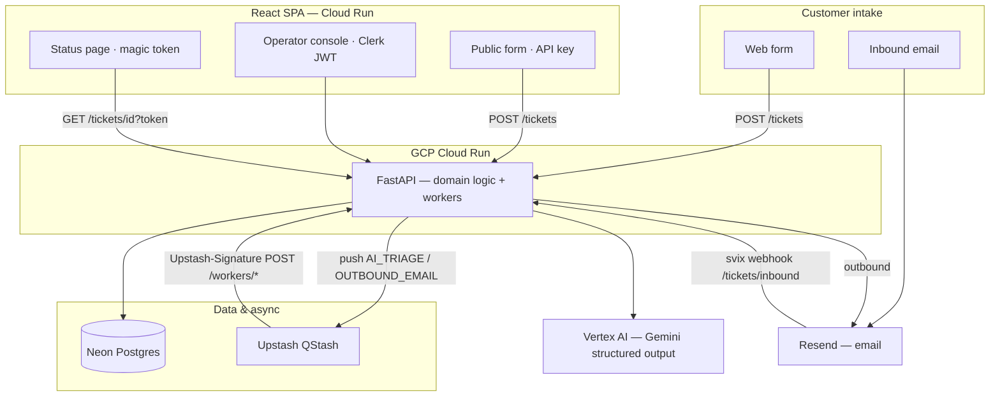

# Triage

AI-assisted support ticketing for small teams — one queue, automatic classification, and email-backed customer updates without a heavy helpdesk.

**Status:** In active development. The monorepo, CI/deploy workflows, and product spec are in place; core features (tickets, triage, operator console) are being built per the week plans.

---

## What it does

Triage gives a small support team a single place to handle customer requests:

| Who | What they get |
|-----|----------------|
| **Customer** | Submit via web form or email; track status with a magic link (no account required). |
| **System** | Classifies each ticket with Gemini (category, priority, escalation, draft reply) and sends confirmation and resolution emails via Resend. |
| **Agent** | Sign in with Clerk; work the queue, edit the AI draft, reply, and resolve. |

**Flow:** intake → async AI triage → confirmation email → operator console → reply and resolve → reply email → customer status page.

**Not in v1:** threading, SLA dashboards, attachments, role hierarchies beyond agent vs customer, multi-tenant orgs. See [docs/triage-prd.md](docs/triage-prd.md) §1.2.

---

## Why teams use it

- **Fast intake** — Web form and inbound email land in one queue.
- **Less triage busywork** — Gemini suggests category, priority, escalation, and a first-draft reply before an agent opens the ticket.
- **Customers stay informed** — Magic-link status pages and transactional email; no portal login.
- **Small-team fit** — One backend, one database, serverless workers — designed to run on free-tier cloud services.

Under the hood: FastAPI, Neon Postgres, Upstash QStash workers, Vertex AI (structured JSON triage in production), Clerk for agents, and Resend for email. Design choices are recorded in [CONTEXT.md](CONTEXT.md) and [docs/adr/](docs/adr/).

---

## Architecture



- **One public Cloud Run backend** — app-layer auth for agents, customers, workers, and webhooks ([ADR-0001](docs/adr/0001-single-public-cloud-run-service.md)).
- **Custom domains** map directly to Cloud Run (`api.*`, `app.*`). A VM/Caddy reverse proxy is **optional**.
- **Deploy identity:** `github-deploy` pushes images; **`triage-runtime@`** runs the service with Secret Manager and Vertex access ([ADR-0006](docs/adr/0006-dedicated-cloud-run-runtime-sa.md)).

Full diagram and service notes: [docs/triage-prd.md](docs/triage-prd.md) §3.

---

## Tech stack

| Layer | Choices |
|-------|---------|
| API | Python 3.13, FastAPI, uv |
| Data | Neon (Postgres), SQLAlchemy, Alembic |
| AI | `google-genai`, Vertex AI (prod), optional API key (local) |
| Queue | Upstash QStash (`Receiver` + signing keys) |
| Email | Resend (+ svix inbound verification) |
| Auth | Clerk (operators), magic tokens (customers), API key (public form) |
| UI | React, Vite, TanStack Router |
| Infra | GCP Cloud Run, Artifact Registry, Secret Manager; GitHub Actions deploy |

Typical running cost on free tiers: **$0/month** ([PRD §14](docs/triage-prd.md)).

---

## Repository layout

```text
backend/          FastAPI app, Alembic, tests
frontend/         React/Vite SPA
docs/
  triage-prd.md   Product spec
  adr/            Architecture decision records
  learning-and-delivery-guide.md
  superpowers/plans/   Week 1–4 implementation plans
CONTEXT.md        Domain glossary + ADR index
```

---

## Documentation

| Doc | Purpose |
|-----|---------|
| [docs/triage-prd.md](docs/triage-prd.md) | Product requirements and scope |
| [CONTEXT.md](CONTEXT.md) | Domain terms and decision index |
| [docs/adr/](docs/adr/) | Architecture decisions (security, deploy, AI, idempotency) |
| [docs/superpowers/plans/](docs/superpowers/plans/) | Week-by-week implementation plans |
| [docs/learning-and-delivery-guide.md](docs/learning-and-delivery-guide.md) | Build order, deployment, and operations |

---

## Local development

```bash
cp .env.example .env   # fill keys for local services
docker compose up --build
```

- Backend: http://localhost:8080/health  
- Frontend: http://localhost:3000  

Local triage can run **synchronously** with `QSTASH_ENABLED=false` while workers are still in progress.

### Tests

```bash
cd backend && uv sync --dev && uv run pytest tests/ -v
cd frontend && pnpm install && pnpm test
```

---

## Deployment (overview)

Production path (detail in [week 4 plan](docs/superpowers/plans/2026-05-22-week4-deployment.md)):

1. Neon database + manual `workflow_dispatch` migrations  
2. GCP Secret Manager (**14** app secrets; no prod `GEMINI_API_KEY` / `QSTASH_SECRET`)  
3. Cloud Run service **`backend`**: `triage-runtime@`, `--timeout=120`, Vertex + `RATE_LIMIT_TICKETS`  
4. Cloud Run frontend with build-time `VITE_*` vars  
5. Resend domain + QStash signing keys; optional custom domains on Run  

CI: `.github/workflows/` run tests and deploy on push to `main` (Workload Identity Federation). Extend the deploy step with Secret Manager and the runtime SA per the week 4 plan for production.

**GitHub configuration** (deploy workflow):

| Name | Type |
|------|------|
| `GCP_WORKLOAD_IDENTITY_PROVIDER` | Secret |
| `GCP_SERVICE_ACCOUNT` | Secret (`github-deploy@...`) |
| `GCP_PROJECT_ID`, `GCP_REGION`, `ARTIFACT_REPO` | Variables |

One-time GCP setup (APIs, Artifact Registry, `github-deploy` SA, Workload Identity Federation): [week 4 plan — Task 2](docs/superpowers/plans/2026-05-22-week4-deployment.md).

---

## Roadmap

| Phase | Focus |
|-------|--------|
| 1 | Models, migrations, ticket CRUD, Clerk + magic token, rate limit |
| 2 | Gemini triage, QStash workers, Resend, inbound webhook |
| 3 | Operator console, customer status page, public form |
| 4 | Secrets, Cloud Run production, Vertex, end-to-end smoke test |

---

## License

See the repository license file if present.
